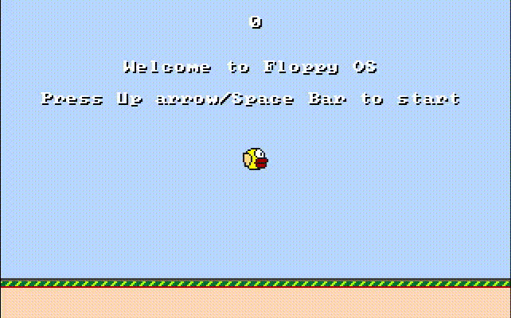

## An x86 OS that can run Flappy Bird
to compile
```
make iso 
```
to compile in debug / text mode 
```
make iso TEXT_MODE=1
```

to run 
```
make run
```
to run in debug / text mode 
```
make run TEXT_MODE=1
```

* This is still in development, this is just an alpha version

## Preview

